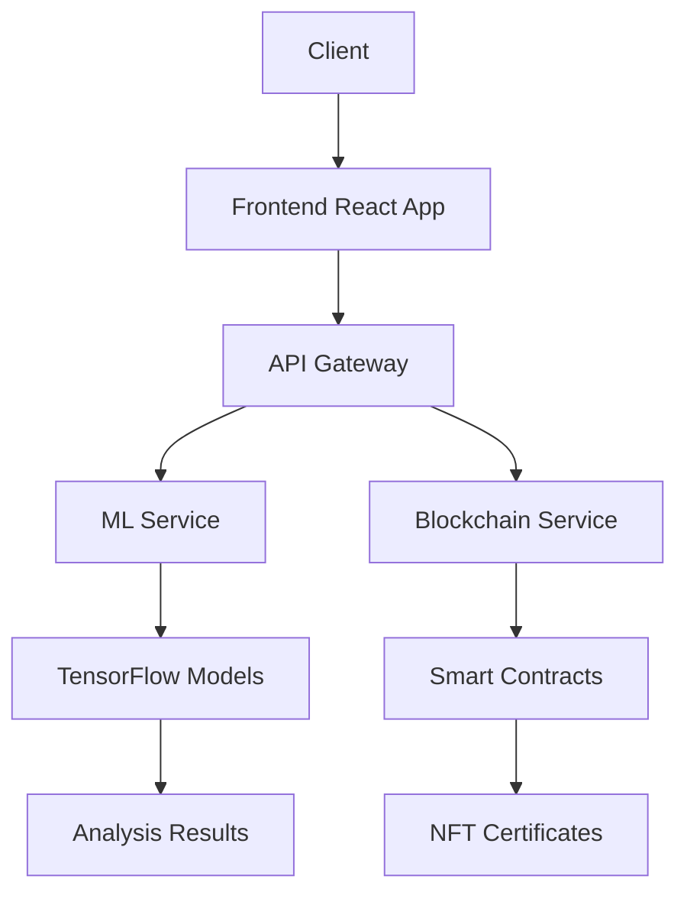

<div align="center">

# TruthLens

[](https://reactjs.org/)
[](https://www.python.org/)
[](https://etherlink.com/)
[](https://www.tensorflow.org/)
[](LICENSE)
[](CONTRIBUTING.md)
[](https://fastapi.tiangolo.com/)
[](https://www.docker.com/)
[](https://www.postgresql.org/)
[](https://mui.com/)
[](https://redux.js.org/)
[](https://nodejs.org/)
[](https://vercel.com/)
[](https://opencv.org/)
[](https://web3js.org/)
[](https://ipfs.io/)
[](https://soliditylang.org/)

A decentralized platform for media authenticity certification using blockchain technology and AI-powered verification.

[Demo](https://truth-lens-seven.vercel.app/) • [Video Demo](https://youtu.be/FxrX2hmo0dc) • [Documentation](#documentation) • [Quick Start](#quick-start)

</div>

## 📑 Table of Contents

- [Overview](#overview)
- [Key Features](#key-features)
- [Technology Stack](#technology-stack)
- [System Architecture](#system-architecture)
- [Smart Contracts](#smart-contracts)
- [Installation Guide](#installation-guide)
- [Usage](#usage)
- [API Documentation](#api-documentation)
- [Team](#team)
- [Acknowledgments](#acknowledgments)

## Overview

TruthLens is a revolutionary platform that combines blockchain technology and artificial intelligence to combat media manipulation and verify digital content authenticity. By leveraging the immutability of blockchain and advanced AI models, TruthLens provides tamper-proof certification for digital media assets.

## Key Features

### Core Functionality
- 🔍 Real-time AI-powered media analysis
- 🔐 Blockchain-based immutable certification
- 📜 Automated NFT certificate minting
- 📊 Comprehensive authenticity reports
- 🌐 Decentralized verification system

### Technical Capabilities
- Deep learning-based image manipulation detection
- Video frame analysis and temporal consistency checking
- Metadata extraction and validation
- Digital signature verification
- Smart contract-based certification management

## Technology Stack

### Frontend
- **Framework:** React 18.2.0
- **State Management:** Redux Toolkit
- **UI Components:** Material-UI v5
- **Web3 Integration:** ethers.js
- **Deployment:** Vercel

### Backend
- **Runtime:** Python 3.9+
- **API Framework:** FastAPI
- **ML Framework:** TensorFlow 2.x
- **Containerization:** Docker
- **Database:** PostgreSQL

### Machine Learning Pipeline
- **Models:**
  - VGG16 (Image Classification)
  - ResNet50 (Feature Extraction)
  - Custom CNN (Manipulation Detection)
- **Training Framework:** TensorFlow/Keras
- **Data Processing:** OpenCV, NumPy
- **Model Serving:** TensorFlow Serving

### Blockchain Infrastructure
- **Network:** Etherlink Testnet
- **Smart Contract Framework:** Brownie
- **Contract Language:** Solidity ^0.8.0
- **Token Standard:** ERC-721 (NFT)
- **IPFS Integration:** Web3.Storage

## System Architecture



## Smart Contracts

### Production Deployments
- **Certificate Contract:** [`0xE20ea5f5a93C42E9d357aE0b6A70E0cCA0e6f88E`](https://testnet.explorer.etherlink.com/address/0xE20ea5f5a93C42E9d357aE0b6A70E0cCA0e6f88E)
  - Handles certificate minting and verification
  - Implements ERC-721 standard
  - Includes metadata storage

- **Governance Contract:** [`0x48280dCF02F926FEB34917eA070F1Fb509ae7491`](https://testnet.explorer.etherlink.com/address/0x48280dCF02F926FEB34917eA070F1Fb509ae7491)
  - Manages platform parameters
  - Controls access permissions
  - Handles protocol upgrades

### Key Transactions
- [Certificate Minting](https://testnet.explorer.etherlink.com/tx/0xbf4999bcbc96019a38bc1ff01550320f3261025477831cdda035650e0454223a)
- [Authenticity Verification](https://testnet.explorer.etherlink.com/tx/0xb2f97e9b7926a52185fda4f1109342a21e37e062eb25e3f304982ac5abf9054f)
- [Token Transfer](https://testnet.explorer.etherlink.com/tx/0xb249886cf362887598555de297b787c6ea80eba08990f31c919ecbca48d003b2)
- [Contract Deployment](https://testnet.explorer.etherlink.com/tx/0xb0ea7ee460d26a5712227e8229d5bcd6e9d61329a7fbe743d93e78fb9e6ab201)

## Installation Guide

### Prerequisites
- Node.js >=16.x
- Python >=3.9
- Docker
- MetaMask wallet
- Git

### Frontend Setup
```bash
# Clone repository
git clone https://github.com/Karthickeien/TruthLens.git
cd TruthLens

# Install dependencies
cd frontend
npm install

# Configure environment
cp .env.example .env
# Update .env with your API keys and contract addresses

# Start development server
npm run dev
```

### Backend Setup
```bash
# Navigate to backend directory
cd backend

# Create virtual environment
python -m venv venv
source venv/bin/activate  # Linux/Mac
.\venv\Scripts\activate   # Windows

# Install dependencies
pip install -r requirements.txt

# Configure environment
cp .env.sample .env
# Update environment variables

# Start server
python main.py
```

### Smart Contract Deployment
```bash
cd blockchain/brownie

# Install Brownie
pip install eth-brownie

# Configure network
brownie networks add Etherlink etherlink-testnet host=https://rpc.etherlink.com chainid=1337

# Deploy contracts
brownie run scripts/deploy.py --network etherlink-testnet
```

### Docker Deployment
```bash
# Build containers
docker-compose build

# Start services
docker-compose up -d
```

## Usage

### Media Analysis
1. Upload media file through the web interface
2. System performs initial analysis using AI models
3. Results are stored on IPFS
4. Smart contract generates NFT certificate
5. Certificate details are recorded on blockchain

### Certificate Verification
1. Input certificate ID or upload media
2. System retrieves blockchain records
3. Compares current analysis with stored results
4. Provides detailed authenticity report

## API Documentation

### REST Endpoints

```typescript
POST /api/v1/analyze
- Analyzes media file and returns results
- Request: multipart/form-data
- Response: AnalysisResult

GET /api/v1/certificate/{id}
- Retrieves certificate details
- Response: CertificateDetails

POST /api/v1/verify
- Verifies media authenticity
- Request: multipart/form-data
- Response: VerificationResult
```

### Smart Contract Interface

```solidity
interface ITruthLensNFT {
    function mintCertificate(
        address to,
        string memory mediaHash,
        string memory resultHash
    ) external returns (uint256);

    function verifyCertificate(
        uint256 tokenId,
        string memory mediaHash
    ) external view returns (bool);
}
```

## Team

### Team UOne
- **Roshan George** - Full Stack Developer & Team Lead
- **Karthickeien Elangovan** - Full Stack Developer & AI - ML Engineer 
- **Mohammed Faheem** - AI - ML Engineer & Blockchain Specialist


## Acknowledgments

- **Event:** Crypto Shield Hackathon 2024
- **Organizer:** Amrita Cyber Nation
- **Project Submission:** [Devfolio](https://devfolio.co/projects/truthlens-cc6b)

## Resources

- [Live Demo](https://truth-lens-seven.vercel.app/)
- [Docker Image](https://hub.docker.com/r/truthlens)
- [Test Dataset](https://www.youtube.com/shorts/vsZZ_LiHGfo)
- [Technical Documentation](./docs)

---

<div align="center">
Made with ❤️ by Team UOne

[Report Bug](https://github.com/Karthickeien/TruthLens/issues) • [Request Feature](https://github.com/Karthickeien/TruthLens/issues)
